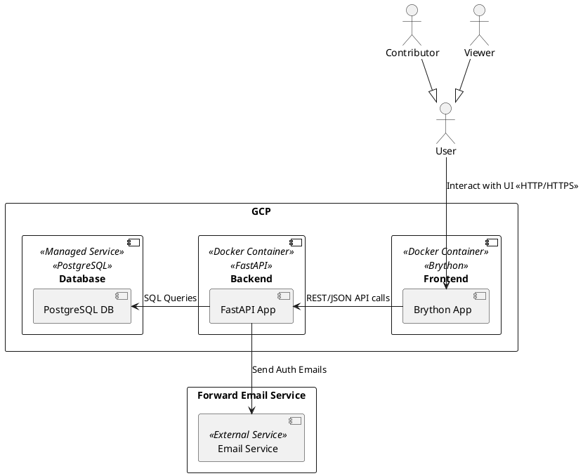
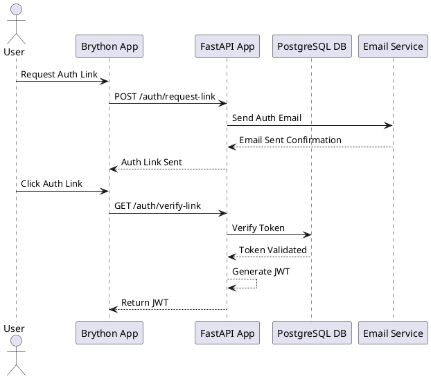

# Game Group Site


## Requirements
- Authentication is done via a passwordless email auth system 
    - User presents email
    - System sends email with one-time link or code to enter
- Authorization
    - Viewer access is done by checking for read access from user database table
    - Contributor access is done by checking contributor access from user database table
- Use Cases
    - Viewing the game library
        - The library of games in the database are presented in a table with redundant entries showing only once but with the names of the contributors who added them in a single cell but separated by commas
        - The table contents are sortable by each column
        - The table contents are filterable by each column
    - Adding games to the library
        - Adding games is by a form requestting details:
            - Game title
            - Game owner (from a list of authorized contributors)
            - Number of players (min and max)
            - Game description
            - Game tags (multiple select from predefined list with ability to add new tags)
            - Game image (optional upload)
            - Boardgamegeek.com link (optional)
            - Boardgamegeek.com rating (optional)

```plantuml
left to right direction 
'User Stories
actor User
User -> (View Game Library)
' (View Game Library) .> User : if Viewer
' View Game Library includes Authentication and Authorization
(View Game Library) .> (Authenticate User)
(View Game Library) .> (Authorize Viewer)
(Add Game to Library) .> (Authenticate User)
(Add Game to Library) .> (Authorize Contributor)
(View Game Library) --> (Display Game Table)
(Display Game Table) --> (Fetch Game Data)
(Display Game Table) --> (Sort/Filter Table)
(Add Game to Library) --> (Submit Game Form)
(Submit Game Form) --> (Validate Form Data)
(Submit Game Form) --> (Store Game in Database)

@enduml
```


## Architecture


### FastAPI Routes
- `POST /auth/request-link` - Request a one-time authentication link via email
- `GET /auth/verify-link` - Verify the one-time authentication link
- `GET /games` - Retrieve the list of games (with optional sorting and filtering parameters)
- `POST /games` - Add a new game to the library (contributor access required)
- `GET /tags` - Retrieve the list of predefined tags
- `POST /tags` - Add a new tag to the predefined list (contributor access required)


### Tech Requirements
- Hosting
    - Containerization with Docker
        - Google Cloud Platform (GCP) using Cloud Run for container hosting
    - All data is stored in a SQL database
        - Managed PostgreSQL instance on GCP
- Email Service
    - Use a third-party email service (Forward Email)
    - FastAPI backend will interact with the email service via their API to send authentication emails
- Security
    - Use HTTPS for all communications between the user and the frontend, and between the frontend and backend

### Proposed Tech Stack
- Frontend
    - Brython
    - ONLY uses REST/JSON API of the backend (no form posts)
- Buisness Logic 
    - FastAPI
- Database
    - PostgreSQL

### Details
- Hosting
    - Google Cloud Platform (GCP) using Cloud Run for container hosting
    - Managed PostgreSQL instance on GCP
- Email Service
    - Use a third-party email service (Forward Email)
    - FastAPI backend will interact with the email service via their API to send authentication emails
- Containerization
    - Use Docker to containerize both the frontend Brython app and the backend FastAPI app
- Security
    - Use HTTPS for all communications between the user and the frontend, and between the frontend and backend
