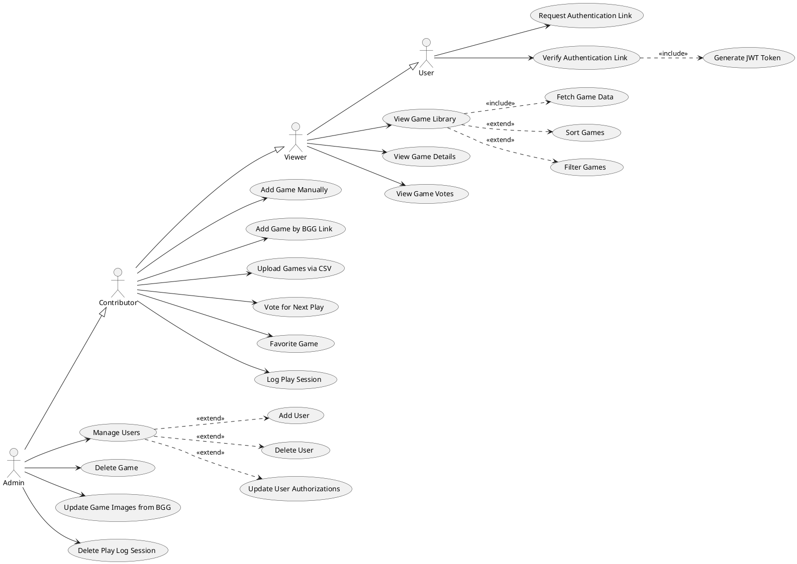
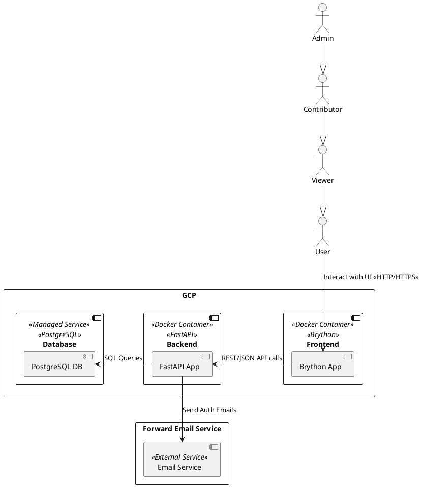
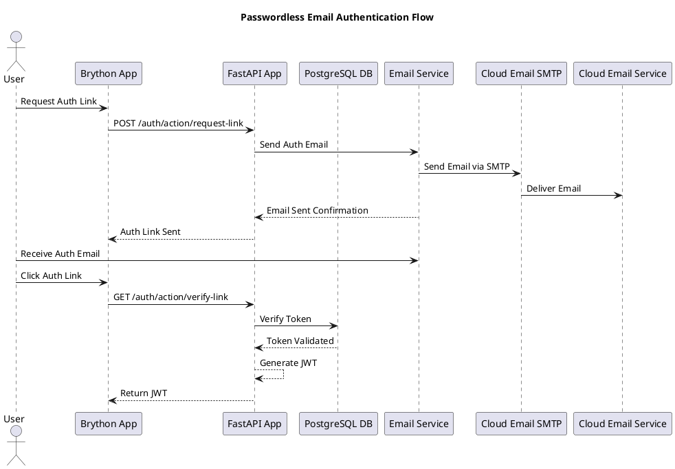
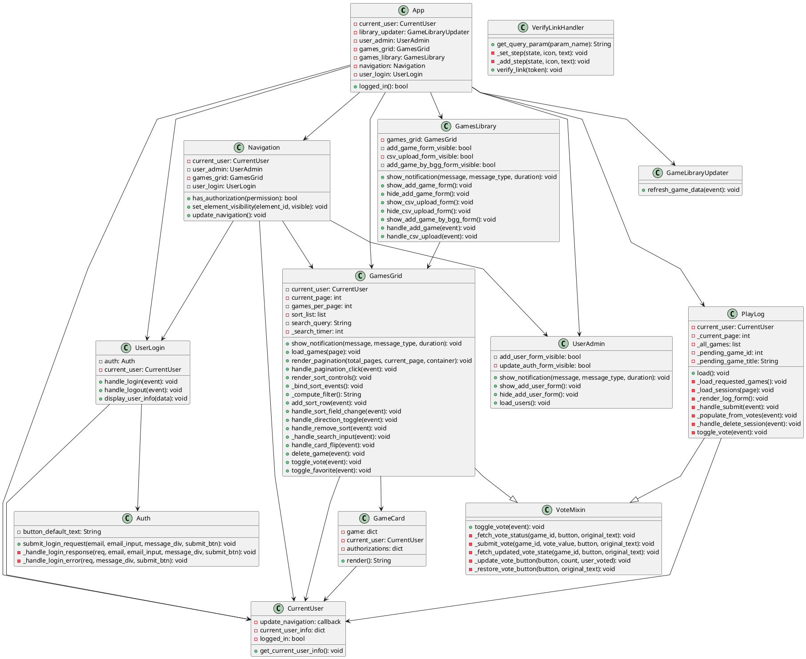
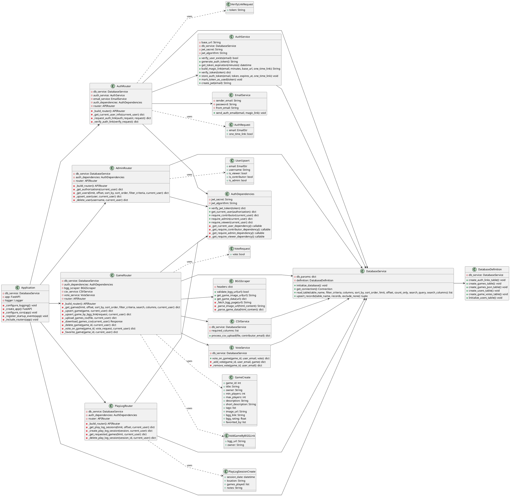
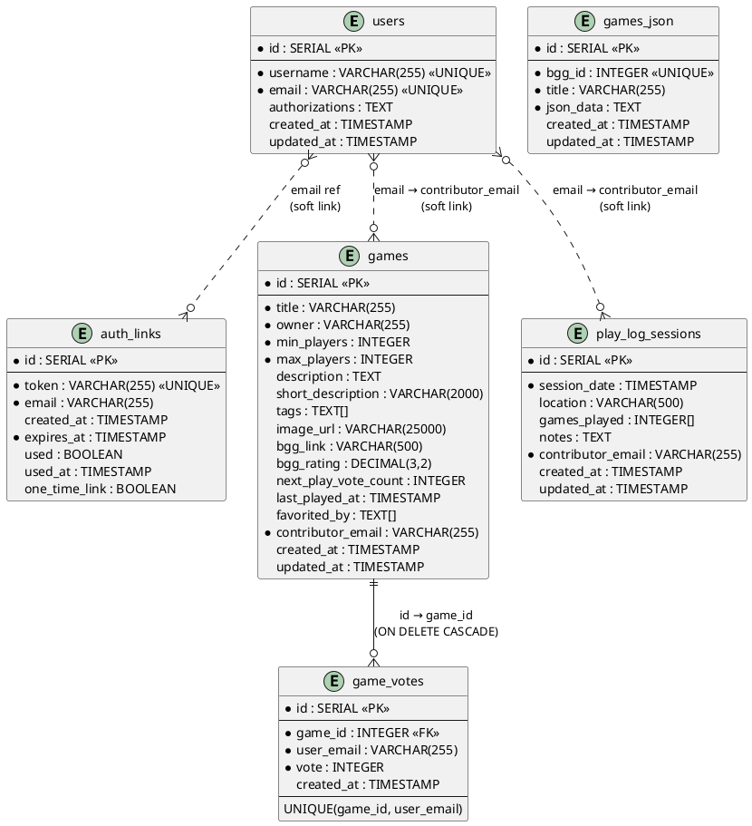

# Game Group Site


## Requirements
- Authentication is done via a passwordless email auth system 
    - User requests authentication link by entering their email
    - System verifies email is in user database table
    - Generates one-time link (magic link)
    - Email is sent to user with link
    - User clicks link which verifies them
    - A JWT token is generated with their user ID and access level (viewer or contributor or admin, etc.)
- Authorization
    - Access is granted by verifying the JWT and the access levels contained therein
    - Three authorization levels: Viewer, Contributor, Admin (with inheritance)

## Use Cases

### Viewer Use Cases
- **View Game Library**
    - Games are displayed in a card grid layout with pagination (20 games per page)
    - Each game card shows title, owner, player count, BGG rating, image, and vote count
    - Cards flip to show additional details on click
    - Sortable by title, date added, owner, player count, BGG rating, or next-play vote count (ascending/descending)
    - Multiple sort keys can be combined
    - Full-text search by title or owner (debounced, 400 ms)
    - Navigation controls for pagination
- **View Game Details**
    - Full game information including description, tags, and BGG link
    - View which users have voted for the game
    - View which users have favorited the game
- **View Play Log**
    - Paginated list of past play sessions (5 per page) in reverse chronological order
    - Each session shows date, location, games played, and notes
    - Top-5 requested games (by vote count) shown at the top of the page
- **View Current User Info**
    - Display email, username, and authorization levels

### Contributor Use Cases (includes all Viewer capabilities)
- **Add Games Manually**
    - Form with fields:
        - Game title (required)
        - Game owner/username (required)
        - Minimum players (required)
        - Maximum players (required)
        - BoardGameGeek link (optional)
        - BoardGameGeek rating (optional)
- **Add Games by BGG Link**
    - Provide BGG URL and owner
    - System scrapes game data from BoardGameGeek
    - Auto-populates title, description, image, player count, and rating
- **Upload Games via CSV**
    - Bulk import games from CSV file
    - Required columns: title, owner, min_players, max_players
    - Optional columns: bgg_link, bgg_rating, description, tags, image_url
- **Vote for Next Play**
    - Toggle vote on games from the Games Library or the Play Log requested-games table
    - Votes are tracked per user and displayed on game cards and in the requested-games table
- **Favorite Games**
    - Mark games as favorites
    - Favorites are tracked per user
- **Log a Play Session**
    - Date/time picker (defaults to next Tuesday at 18:00)
    - Free-text location field
    - Multi-select game picker with search
    - "Populate from Votes" button pre-fills games from the requested-games table
    - Free-text notes field

### Admin Use Cases (includes all Contributor capabilities)
- **Delete Games**
    - Remove games from the library
- **Manage Users**
    - View all users in the system
    - Add new users with email and username
    - Set user authorization levels (Viewer, Contributor, Admin)
    - Update user authorizations
    - Delete users from the system
- **Update Game Images**
    - Batch update missing game images by scraping BoardGameGeek
    - Processes games with BGG links but missing images
- **Delete Play Log Sessions**
    - Remove individual play session records


```plantuml
@startuml
left to right direction

' Actors with inheritance
actor User
actor Viewer
actor Contributor
actor Admin

Viewer --|> User
Contributor --|> Viewer
Admin --|> Contributor

' Authentication Use Cases (all users)
User --> (Request Authentication Link)
User --> (Verify Authentication Link)
(Verify Authentication Link) ..> (Generate JWT Token) : <<include>>

' Game Library Viewing (Viewer+)
Viewer --> (View Game Library)
(View Game Library) ..> (Fetch Game Data) : <<include>>
(View Game Library) ..> (Sort Games) : <<extend>>
(View Game Library) ..> (Filter Games) : <<extend>>
Viewer --> (View Game Details)
Viewer --> (View Game Votes)

' Game Management (Contributor+)
Contributor --> (Add Game Manually)
Contributor --> (Add Game by BGG Link)
Contributor --> (Upload Games via CSV)
Contributor --> (Vote for Next Play)
Contributor --> (Favorite Game)
Contributor --> (Log Play Session)

' Admin Functions (Admin only)
Admin --> (Manage Users)
Admin --> (Delete Game)
(Manage Users) ..> (Add User) : <<extend>>
(Manage Users) ..> (Delete User) : <<extend>>
(Manage Users) ..> (Update User Authorizations) : <<extend>>
Admin --> (Update Game Images from BGG)
Admin --> (Delete Play Log Session)

@enduml
```


## Architecture


```plantuml
@startuml
actor User
actor Viewer
actor Contributor
actor Admin
'inheritance chain: Viewer > User, Contributor > Viewer, Admin > Contributor
Viewer --|> User
Contributor --|> Viewer
Admin --|> Contributor

rectangle "GCP" {
    component "Frontend" <<Docker Container>> <<Brython>> {
        component "Brython App"
    }
    component "Backend" <<Docker Container>> <<FastAPI>> {
        component "FastAPI App"
    }
    component "Database" <<Managed Service>> <<PostgreSQL>> {
        component "PostgreSQL DB"
    }
}
rectangle "Forward Email Service" {
    component "Email Service" <<External Service>> {
    }
}
"FastAPI App" -d-> "Email Service" : Send Auth Emails
"Brython App" -r-> "FastAPI App" : REST/JSON API calls
"FastAPI App" -r-> "PostgreSQL DB" : SQL Queries

User --> "Brython App" : Interact with UI <<HTTP/HTTPS>>
@enduml
```
### FastAPI Routes

#### Authentication
- `POST /auth/action/request-link` - Request a one-time authentication link via email (only sends if email exists in user table)
- `GET /auth/action/verify-link` - Verify the one-time authentication link and return JWT token
- `GET /auth/me` - Get current authenticated user information including authorizations

#### Games
- `GET /game` - Retrieve the list of games with pagination, optional sorting, filtering, and full-text search (viewer access required)
- `POST /game` - Add or update a game in the library (contributor access required)
- `POST /game/action/add-game-by-bgg-link` - Add or update a game from a BoardGameGeek URL (contributor access required)
- `POST /game/upload-csv` - Upload CSV file to bulk import games (contributor access required)
- `GET /game/download-csv` - Download all games as a CSV file (viewer access required)
- `DELETE /game/{game_id}` - Delete a game from the library (admin access required)
- `GET /game/{game_id}/vote` - Get current user's vote status for a game (viewer access required)
- `POST /game/{game_id}/vote` - Toggle next-play vote for a game (contributor access required)

#### Play Log
- `GET /play-log` - Retrieve paginated play log sessions in reverse chronological order (viewer access required)
- `POST /play-log` - Create a new play log session entry (contributor access required)
- `GET /play-log/requested-games` - Retrieve the top voted games for next play (viewer access required)
- `DELETE /play-log/{session_id}` - Delete a play log session (admin access required)

#### Admin
- `POST /admin/action/update-game-images` - Update missing game image URLs from BoardGameGeek (admin access required)
- `GET /admin/user` - Get all users in the system (admin access required)

#### Other
- `GET /` - Root endpoint, returns Hello World

<hr>


```plantuml
@startuml
title Passwordless Email Authentication Flow
actor User
participant "Brython App" as Brython
participant "FastAPI App" as FastAPI
participant "PostgreSQL DB" as DB
participant "Email Service" as EmailService
participant "Cloud Email SMTP" as CloudEmailSMTP
participant "Cloud Email Service" as CloudEmailService
User -> Brython : Request Auth Link
Brython -> FastAPI : POST /auth/action/request-link
FastAPI -> EmailService : Send Auth Email
EmailService -> CloudEmailSMTP : Send Email via SMTP
CloudEmailSMTP -> CloudEmailService : Deliver Email
EmailService --> FastAPI : Email Sent Confirmation
FastAPI --> Brython : Auth Link Sent
User -> EmailService : Receive Auth Email
User -> Brython : Click Auth Link
Brython -> FastAPI : GET /auth/action/verify-link
FastAPI -> DB : Verify Token
DB --> FastAPI : Token Validated
FastAPI --> FastAPI : Generate JWT
FastAPI --> Brython : Return JWT
@enduml
```
### Tech Requirements
- Stack
    - Frontend
        - Brython
        - ONLY uses REST/JSON API of the backend (no form posts)
    - Buisness Logic 
        - FastAPI 
    - Database
        - PostgreSQL
- Hosting
    - Google Cloud Platform (GCP) using Cloud Run for container hosting
    - Managed PostgreSQL instance on GCP
- Email Service
    - Use a third-party email service (Forward Email)
    - FastAPI backend will interact with the email service via SMTP to send authentication emails
- Containerization
    - Use Docker to containerize both the frontend Brython app and the backend FastAPI app
- Security
    - Use HTTPS for all communications between the user and the frontend, and between the frontend and backend


### Code organization
```
backend/
├── main.py                        # Application class (FastAPI setup and startup)
├── database_service.py            # DatabaseService (shared DB access layer)
├── db_definition.py               # DatabaseDefinition (schema creation)
├── auth_dependencies.py           # AuthDependencies (JWT auth FastAPI deps)
├── requirements.txt
├── Dockerfile
└── routers/
    ├── __init__.py
    ├── admin/
    │   ├── __init__.py
    │   ├── router.py              # AdminRouter (user management routes)
    │   └── models.py              # Pydantic models: UserUpsert
    ├── auth/
    │   ├── __init__.py
    │   ├── router.py              # AuthRouter (login/verify/me routes)
    │   ├── models.py              # Pydantic models: AuthRequest, VerifyLinkRequest
    │   ├── auth_service.py        # AuthService (token generation/verification)
    │   └── email_service.py       # EmailService (SMTP magic-link delivery)
    ├── game/
    │   ├── __init__.py
    │   ├── router.py              # GameRouter (CRUD, vote, favorite, CSV routes)
    │   ├── models.py              # Pydantic models: GameCreate, AddGameByBGGLink, VoteRequest
    │   ├── helpers.py             # upsert_game_to_db() helper
    │   ├── bgg_scraper.py         # BGGScraper (BoardGameGeek scraper)
    │   ├── csv_service.py         # CSVService (bulk CSV upload/download)
    │   └── vote_service.py        # VoteService (game vote logic)
    └── play_log/
        ├── __init__.py
        ├── router.py              # PlayLogRouter (session CRUD, requested-games)
        └── models.py              # Pydantic models: PlayLogSessionCreate

frontend/
├── app.py                         # App class (main entry point, wires components)
├── auth.py                        # Auth (magic-link request handler)
├── config.py                      # Configuration (BASE_URL)
├── current_user.py                # CurrentUser (JWT/session state)
├── game_card.py                   # GameCard (renders individual game tile HTML)
├── game_library_updater.py        # GameLibraryUpdater (BGG bulk refresh)
├── games_grid.py                  # GamesGrid (pagination, sorting, search, votes/favorites)
├── games_library.py               # GamesLibrary (add-game and CSV upload forms)
├── navigation.py                  # Navigation (hash routing, auth-gated nav)
├── play_log.py                    # PlayLog (requested games, log form, past sessions)
├── user_admin.py                  # UserAdmin (admin user management panel)
├── user_login.py                  # UserLogin (login form, logout)
├── vote_mixin.py                  # VoteMixin (shared next-play vote toggle logic)
├── index.html                     # Main HTML page
├── main.css                       # Main stylesheet
├── nginx.conf                     # Nginx configuration
├── Dockerfile
└── auth/
    └── action/
        ├── config.py              # Verify-link page configuration
        ├── verify_link_handler.py # VerifyLinkHandler (token verification + JWT storage)
        ├── verify-link            # Verify link HTML page
        └── verify-link.css        # Verify link styles
```


### Class Diagram - Frontend


```plantuml
@startuml
skinparam linetype polyline
class App {
    - current_user: CurrentUser
    - library_updater: GameLibraryUpdater
    - user_admin: UserAdmin
    - games_grid: GamesGrid
    - games_library: GamesLibrary
    - navigation: Navigation
    - user_login: UserLogin
    + logged_in(): bool
}

class Auth {
    - button_default_text: String
    + submit_login_request(email, email_input, message_div, submit_btn): void
    - _handle_login_response(req, email, email_input, message_div, submit_btn): void
    - _handle_login_error(req, message_div, submit_btn): void
}

class CurrentUser {
    - update_navigation: callback
    - current_user_info: dict
    - logged_in: bool
    + get_current_user_info(): void
}

class UserLogin {
    - auth: Auth
    - current_user: CurrentUser
    + handle_login(event): void
    + handle_logout(event): void
    + display_user_info(data): void
}

class Navigation {
    - current_user: CurrentUser
    - user_admin: UserAdmin
    - games_grid: GamesGrid
    - user_login: UserLogin
    + has_authorization(permission): bool
    + set_element_visibility(element_id, visible): void
    + update_navigation(): void
}

class GamesLibrary {
    - games_grid: GamesGrid
    - add_game_form_visible: bool
    - csv_upload_form_visible: bool
    - add_game_by_bgg_form_visible: bool
    + show_notification(message, message_type, duration): void
    + show_add_game_form(): void
    + hide_add_game_form(): void
    + show_csv_upload_form(): void
    + hide_csv_upload_form(): void
    + show_add_game_by_bgg_form(): void
    + handle_add_game(event): void
    + handle_csv_upload(event): void
}

class GamesGrid {
    - current_user: CurrentUser
    - current_page: int
    - games_per_page: int
    - sort_list: list
    - search_query: String
    - _search_timer: int
    + show_notification(message, message_type, duration): void
    + load_games(page): void
    + render_pagination(total_pages, current_page, container): void
    + handle_pagination_click(event): void
    + render_sort_controls(): void
    + _bind_sort_events(): void
    + _compute_filter(): String
    + add_sort_row(event): void
    + handle_sort_field_change(event): void
    + handle_direction_toggle(event): void
    + handle_remove_sort(event): void
    + _handle_search_input(event): void
    + handle_card_flip(event): void
    + delete_game(event): void
    + toggle_vote(event): void
    + toggle_favorite(event): void
}

class GameCard {
    - game: dict
    - current_user: CurrentUser
    - authorizations: dict
    + render(): String
}

class UserAdmin {
    - add_user_form_visible: bool
    - update_auth_form_visible: bool
    + show_notification(message, message_type, duration): void
    + show_add_user_form(): void
    + hide_add_user_form(): void
    + load_users(): void
}

class PlayLog {
    - current_user: CurrentUser
    - _current_page: int
    - _all_games: list
    - _pending_game_id: int
    - _pending_game_title: String
    + load(): void
    - _load_requested_games(): void
    - _load_sessions(page): void
    - _render_log_form(): void
    - _handle_submit(event): void
    - _populate_from_votes(event): void
    - _handle_delete_session(event): void
    - toggle_vote(event): void
}

class VoteMixin {
    + toggle_vote(event): void
    - _fetch_vote_status(game_id, button, original_text): void
    - _submit_vote(game_id, vote_value, button, original_text): void
    - _fetch_updated_vote_state(game_id, button, original_text): void
    - _update_vote_button(button, count, user_voted): void
    - _restore_vote_button(button, original_text): void
}

class GameLibraryUpdater {
    + refresh_game_data(event): void
}

class VerifyLinkHandler {
    + get_query_param(param_name): String
    - _set_step(state, icon, text): void
    - _add_step(state, icon, text): void
    + verify_link(token): void
}

App --> CurrentUser
App --> UserLogin
App --> Navigation
App --> GamesLibrary
App --> GamesGrid
App --> UserAdmin
App --> GameLibraryUpdater
App --> PlayLog
UserLogin --> Auth
UserLogin --> CurrentUser
Navigation --> CurrentUser
Navigation --> UserLogin
Navigation --> UserAdmin
Navigation --> GamesGrid
GamesLibrary --> GamesGrid
GamesGrid --> CurrentUser
GamesGrid --> GameCard
GamesGrid --|> VoteMixin
PlayLog --> CurrentUser
PlayLog --|> VoteMixin
GameCard --> CurrentUser
@enduml
```

### Class Diagram - Backend


```plantuml
@startuml
left to right direction
skinparam linetype polyline 

' package "Application" {
    class Application {
        - db_service: DatabaseService
        - app: FastAPI
        - logger: Logger
        - _configure_logging(): void
        - _create_app(): FastAPI
        - _configure_cors(app): void
        - _register_startup_events(app): void
        - _include_routers(app): void
    }
' }

' package "Routers" {
    class AuthRouter {
        - db_service: DatabaseService
        - auth_service: AuthService
        - email_service: EmailService
        - auth_dependencies: AuthDependencies
        - router: APIRouter
        - _build_router(): APIRouter
        - _get_current_user_info(current_user): dict
        - _request_auth_link(auth_request, request): dict
        - _verify_auth_link(verify_request): dict
    }

    class AdminRouter {
        - db_service: DatabaseService
        - auth_dependencies: AuthDependencies
        - router: APIRouter
        - _build_router(): APIRouter
        - _get_authorizations(current_user): dict
        - _get_users(limit, offset, sort_by, sort_order, filter_criteria, current_user): dict
        - _upsert_user(user, current_user): dict
        - _delete_user(username, current_user): dict
    }

    class GameRouter {
        - db_service: DatabaseService
        - auth_dependencies: AuthDependencies
        - bgg_scraper: BGGScraper
        - csv_service: CSVService
        - vote_service: VoteService
        - router: APIRouter
        - _build_router(): APIRouter
        - _get_games(limit, offset, sort_by, sort_order, filter_criteria, search, columns, current_user): dict
        - _upsert_game(game, current_user): dict
        - _upsert_game_by_bgg_link(request, current_user): dict
        - _upload_games_csv(file, current_user): dict
        - _download_games_csv(current_user): Response
        - _delete_game(game_id, current_user): dict
        - _vote_on_game(game_id, vote_request, current_user): dict
        - _favorite_game(game_id, current_user): dict
    }

    class PlayLogRouter {
        - db_service: DatabaseService
        - auth_dependencies: AuthDependencies
        - router: APIRouter
        - _build_router(): APIRouter
        - _get_play_log_sessions(limit, offset, current_user): dict
        - _create_play_log_session(session, current_user): dict
        - _get_requested_games(limit, current_user): dict
        - _delete_play_log_session(session_id, current_user): dict
    }
' }

' package "Services" {
    class DatabaseService {
        - db_params: dict
        - definition: DatabaseDefinition
        + initialize_database(): void
        + get_connection(): Connection
        + read_table(table_name, filter_criteria, columns, sort_by, sort_order, limit, offset, count_only, search_query, search_columns): list
        + upsert_records(table_name, records, exclude_none): tuple
    }

    class DatabaseDefinition {
        - db_service: DatabaseService
        + create_auth_links_table(): void
        + create_games_table(): void
        + create_games_json_table(): void
        + create_users_table(): void
        + create_game_votes_table(): void
        + Initialize_users_table(): void
    }

    class AuthService {
        - base_url: String
        - db_service: DatabaseService
        - jwt_secret: String
        - jwt_algorithm: String
        + verify_user_exists(email): bool
        + generate_auth_token(): String
        + get_token_expiration(minutes): datetime
        + build_magic_link(email, minutes, base_url, one_time_link): String
        + verify_token(token): dict
        + store_auth_token(email, token, expires_at, one_time_link): void
        + mark_token_as_used(token): void
        + create_jwt(email): String
    }

    class EmailService {
        - sender_email: String
        - password: String
        - from_email: String
        + send_auth_email(email, magic_link): void
    }

    class AuthDependencies {
        - jwt_secret: String
        - jwt_algorithm: String
        + verify_jwt_token(token): dict
        + get_current_user(authorization): dict
        + require_contributor(current_user): dict
        + require_admin(current_user): dict
        + require_viewer(current_user): dict
        - _get_current_user_dependency(): callable
        - _get_require_contributor_dependency(): callable
        - _get_require_admin_dependency(): callable
        - _get_require_viewer_dependency(): callable
    }

    class BGGScraper {
        - headers: dict
        + validate_bgg_url(url): bool
        + get_game_image_url(url): String
        + get_game_data(url): dict
        - _fetch_bgg_page(url): String
        - _parse_image_url(html_content): String
        - _parse_game_data(html_content): dict
    }

    class CSVService {
        - db_service: DatabaseService
        - required_columns: list
        + process_csv_upload(file, contributor_email): dict
    }

    class VoteService {
        - db_service: DatabaseService
        + vote_on_game(game_id, user_email, vote): dict
        - _add_vote(game_id, user_email, game): dict
        - _remove_vote(game_id, user_email): dict
    }
' }

' package "Pydantic Models" {
    class AuthRequest {
        + email: EmailStr
        + one_time_link: bool
    }

    class VerifyLinkRequest {
        + token: String
    }

    class UserUpsert {
        + email: EmailStr
        + username: String
        + is_viewer: bool
        + is_contributor: bool
        + is_admin: bool
    }

    class GameCreate {
        + game_id: int
        + title: String
        + owner: String
        + min_players: int
        + max_players: int
        + description: String
        + short_description: String
        + tags: list
        + image_url: String
        + bgg_link: String
        + bgg_rating: float
        + favorited_by: list
    }

    class AddGameByBGGLink {
        + bgg_url: String
        + owner: String
    }

    class VoteRequest {
        + vote: bool
    }

    class PlayLogSessionCreate {
        + session_date: datetime
        + location: String
        + games_played: list
        + notes: String
    }
' }

/' Relationships '/
Application --> AuthRouter
Application --> AdminRouter
Application --> GameRouter
Application --> PlayLogRouter
Application --> DatabaseService
AuthRouter --> DatabaseService
AuthRouter --> AuthService
AuthRouter --> EmailService
AuthRouter --> AuthDependencies
AdminRouter --> DatabaseService
AdminRouter --> AuthDependencies
GameRouter --> DatabaseService
GameRouter --> AuthDependencies
GameRouter --> BGGScraper
GameRouter --> CSVService
GameRouter --> VoteService
PlayLogRouter --> DatabaseService
PlayLogRouter --> AuthDependencies
AuthService --> DatabaseService
CSVService --> DatabaseService
VoteService --> DatabaseService
DatabaseService --> DatabaseDefinition
AuthRouter ..> AuthRequest : uses
AuthRouter ..> VerifyLinkRequest : uses
AdminRouter ..> UserUpsert : uses
GameRouter ..> GameCreate : uses
GameRouter ..> AddGameByBGGLink : uses
GameRouter ..> VoteRequest : uses
PlayLogRouter ..> PlayLogSessionCreate : uses
@enduml
```

### Database ERD


```plantuml
@startuml
entity "users" {
    * id : SERIAL <<PK>>
    --
    * username : VARCHAR(255) <<UNIQUE>>
    * email : VARCHAR(255) <<UNIQUE>>
    authorizations : TEXT
    created_at : TIMESTAMP
    updated_at : TIMESTAMP
}

entity "auth_links" {
    * id : SERIAL <<PK>>
    --
    * token : VARCHAR(255) <<UNIQUE>>
    * email : VARCHAR(255)
    created_at : TIMESTAMP
    * expires_at : TIMESTAMP
    used : BOOLEAN
    used_at : TIMESTAMP
    one_time_link : BOOLEAN
}

entity "games" {
    * id : SERIAL <<PK>>
    --
    * title : VARCHAR(255)
    * owner : VARCHAR(255)
    * min_players : INTEGER
    * max_players : INTEGER
    description : TEXT
    short_description : VARCHAR(2000)
    tags : TEXT[]
    image_url : VARCHAR(25000)
    bgg_link : VARCHAR(500)
    bgg_rating : DECIMAL(3,2)
    next_play_vote_count : INTEGER
    last_played_at : TIMESTAMP
    favorited_by : TEXT[]
    * contributor_email : VARCHAR(255)
    created_at : TIMESTAMP
    updated_at : TIMESTAMP
}

entity "game_votes" {
    * id : SERIAL <<PK>>
    --
    * game_id : INTEGER <<FK>>
    * user_email : VARCHAR(255)
    * vote : INTEGER
    created_at : TIMESTAMP
    --
    UNIQUE(game_id, user_email)
}

entity "games_json" {
    * id : SERIAL <<PK>>
    --
    * bgg_id : INTEGER <<UNIQUE>>
    * title : VARCHAR(255)
    * json_data : TEXT
    created_at : TIMESTAMP
    updated_at : TIMESTAMP
}

entity "play_log_sessions" {
    * id : SERIAL <<PK>>
    --
    * session_date : TIMESTAMP
    location : VARCHAR(500)
    games_played : INTEGER[]
    notes : TEXT
    * contributor_email : VARCHAR(255)
    created_at : TIMESTAMP
    updated_at : TIMESTAMP
}

games ||--o{ game_votes : "id → game_id\n(ON DELETE CASCADE)"
users }o..o{ auth_links : "email ref\n(soft link)"
users }o..o{ games : "email → contributor_email\n(soft link)"
users }o..o{ play_log_sessions : "email → contributor_email\n(soft link)"
@enduml
```

### TODOs
##### Functionality
- [ ] TODO: Fix bug where the card flip on the game cards doesn't work correctly on Firefox
##### Security
- [ ] TODO: Harden read_table() against SQL injection by validating table_name and filter_criteria inputs
- [ ] TODO: Make filter_criteria safer by accepting a list of tuples of (column, operator, value) and building the WHERE clause using that information and escaping text values by encoding them as base64 and decoding them in the backend before using them in the query. This would prevent SQL injection while still allowing for flexible filtering.
##### Deployment/Configuration
- [x] TODO: Make the frontend nginx configuration ports (8082 and 8443) configurable via environment variables for flexible deployment
- [x] TODO: Make the frontend nginx server_name configurable via environment variables for flexible domain configuration
##### Code Quality/Maintainability
- [ ] TODO: Clean up the date handling in the play log router to not be a roll-your-own date parser and instead use a library like dateutil to parse the dates in a more flexible and robust way
- [ ] TODO: Routers need to use response models and proper status codes instead of just returning dicts with messages and 200 status
- [ ] TODO: Unit Testing - add unit tests for the backend services and routers to ensure proper functionality and prevent regressions
- [ ] TODO: Unit Testing - add unit tests for the frontend components to ensure they render correctly and handle user interactions as expected
##### Completed
- [x] TODO: Add a Play Log section recording when users play games and with whom, etc.
    - Requested Games table (top 5 by vote, checkbox-selectable, with inline vote toggle for contributors)
    - Log entry form: date/time, location, game multi-select with search, Populate from Votes button, notes, submit/cancel
    - Paginated past sessions view (5 per page) with admin delete
- [x] TODO: Add vote-toggle buttons to the Play Log requested-games table (contributors only)
- [x] TODO: Extract vote-toggle logic into a shared `VoteMixin` so `GamesGrid` and `PlayLog` stay DRY
- [x] TODO: Add full-text search to the games grid (title + owner, debounced, parameterized ILIKE on the backend)
- [x] TODO: Rework the Authorizations in the JWT to use an Authorization object that is a list of the authorization levels of the user instead of the current dict of booleans
- [x] TODO: Move database table creation from the DatabaseService into the DatabaseDefinition class initialization to separate concerns and keep the DatabaseService focused on providing a flexible interface for executing queries and managing connections
- [x] TODO: Fix the button binding in play log router to not be a hacky global event listener and instead be properly bound to the buttons when they are rendered. There probably needs to be separate forms for adding by votes vs. manually selecting the games to avoid the complexity of trying to determine which form the user is submitting when they click the submit button.
- [x] TODO: Add a Next Play section showing which games people want to play next and allowing people to vote on which games they want to play next
- [x] TODO: Add an automatic population by providing BGG link and scraping BGG for the info
- [x] TODO: Add router and tags to categorize the API endpoints better and make them more maintainable
- [x] TODO: Fix the whole db_util class to be flexible instead of one-off per query and table
- [x] TODO: Make the forwarded port/host detection in the backend configurable from application config instead of using hardcoded conditional logic
- [x] TODO: Update the admin user retrieval in the backend to allow filtering by email or other parameters for frontend admin panel management
