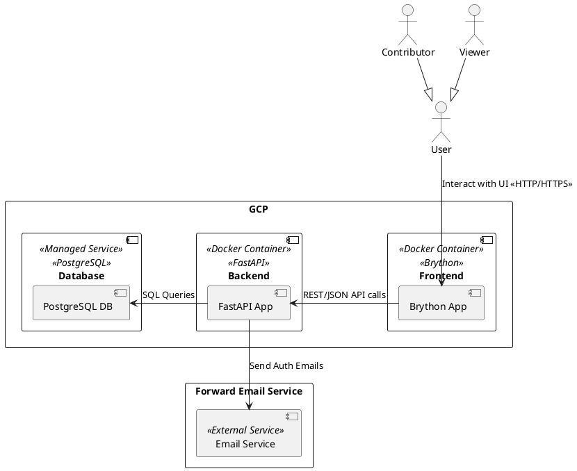
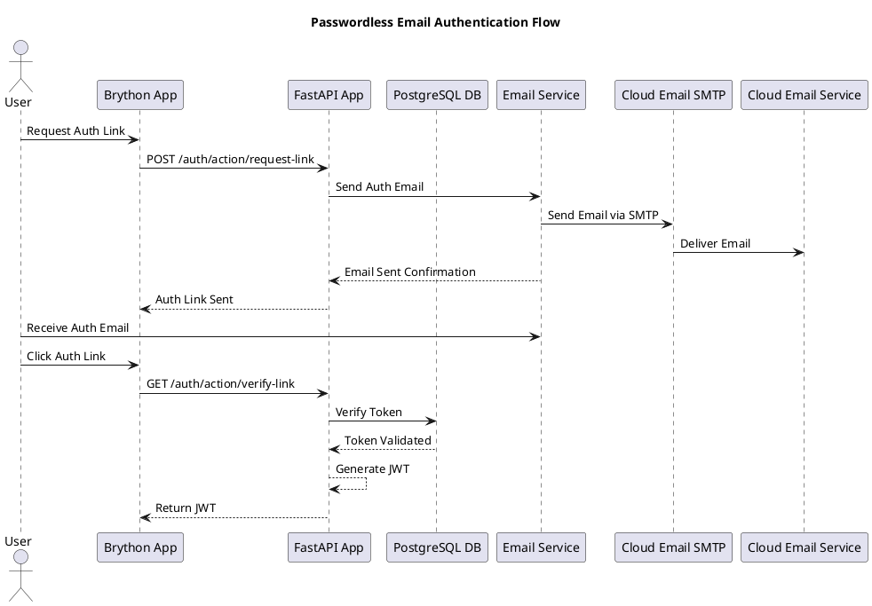
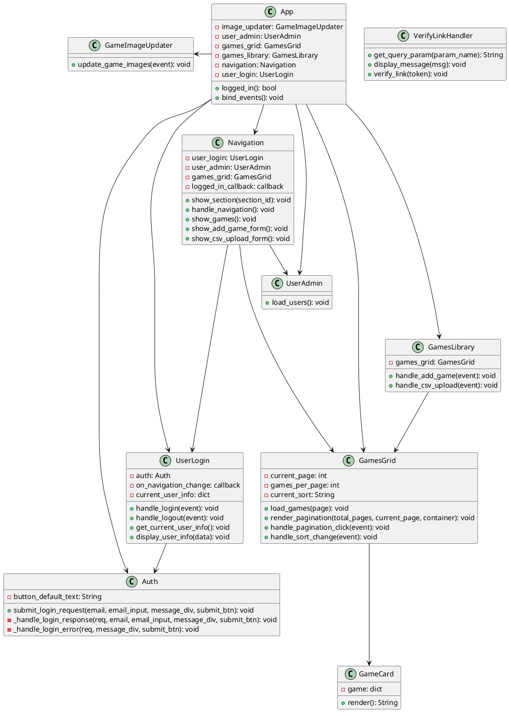

# Game Group Site

## Requirements
- Authentication is done via a passwordless email auth system 
    - User requests authentication link by entering their email
    - System verifies email is in user database table
    - Generates one-time link (magic link)
    - Email is sent to user with link
    - User clicks link which verifies them
    - A JWT token is generated with their user ID and access level (viewer or contributor or admin, etc.)
- Authorization
    - Access is granted by verifying the JWT and the access levels contained therein
- Use Cases
    - Viewing the game library
        - The library of games in the database are presented in a table with redundant entries showing only once but with the names of the contributors who added them in a single cell but separated by commas
        - The table contents are sortable by each column
        - The table contents are filterable by each column
    - Adding games to the library
        - Adding games is by a form requestting details:
            - Game title
            - Game owner (from a list of authorized contributors)
            - Number of players (min and max)
            - Game description
            - Game tags (multiple select from predefined list with ability to add new tags)
            - Game image (optional upload)
            - Boardgamegeek.com link (optional)
            - Boardgamegeek.com rating (optional)

```plantuml
left to right direction 
'User Stories
actor User
User -> (View Game Library)
' (View Game Library) .> User : if Viewer
' View Game Library includes Authentication and Authorization
(View Game Library) .> (Authenticate User)
(View Game Library) .> (Authorize Viewer)
(Add Game to Library) .> (Authenticate User)
(Add Game to Library) .> (Authorize Contributor)
(View Game Library) --> (Display Game Table)
(Display Game Table) --> (Fetch Game Data)
(Display Game Table) --> (Sort/Filter Table)
(Add Game to Library) --> (Submit Game Form)
(Submit Game Form) --> (Validate Form Data)
(Submit Game Form) --> (Store Game in Database)

@enduml
```

## Architecture

```plantuml
@startuml
actor User
actor Contributor
actor Viewer
'viewer and contributor are both users subtypes of user
Viewer --|> User
Contributor --|> User

rectangle "GCP" {
    component "Frontend" <<Docker Container>> <<Brython>> {
        component "Brython App"
    }
    component "Backend" <<Docker Container>> <<FastAPI>> {
        component "FastAPI App"
    }
    component "Database" <<Managed Service>> <<PostgreSQL>> {
        component "PostgreSQL DB"
    }
}
rectangle "Forward Email Service" {
    component "Email Service" <<External Service>> {
    }
}
"FastAPI App" -d-> "Email Service" : Send Auth Emails
"Brython App" -r-> "FastAPI App" : REST/JSON API calls
"FastAPI App" -r-> "PostgreSQL DB" : SQL Queries

User --> "Brython App" : Interact with UI <<HTTP/HTTPS>>
@enduml
```
### FastAPI Routes

#### Authentication
- `POST /auth/action/request-link` - Request a one-time authentication link via email (only sends if email exists in user table)
- `GET /auth/action/verify-link` - Verify the one-time authentication link and return JWT token
- `GET /auth/me` - Get current authenticated user information including authorizations

#### Games
- `GET /game` - Retrieve the list of games with pagination and optional sorting (viewer access required)
- `POST /game` - Add a new game to the library (contributor access required)
- `POST /game/upload-csv` - Upload CSV file to bulk import games (contributor access required)

#### Tags
- `GET /tag` - Retrieve the list of predefined tags (TODO: not yet implemented)
- `POST /tag` - Add a new tag to the predefined list (contributor access required, TODO: not yet implemented)

#### Admin
- `POST /admin/action/update-game-images` - Update missing game image URLs from BoardGameGeek (admin access required)
- `GET /admin/user` - Get all users in the system (admin access required)

#### Other
- `GET /` - Root endpoint, returns Hello World

```plantuml
@startuml
title Passwordless Email Authentication Flow
actor User
participant "Brython App" as Brython
participant "FastAPI App" as FastAPI
participant "PostgreSQL DB" as DB
participant "Email Service" as EmailService
participant "Cloud Email SMTP" as CloudEmailSMTP
participant "Cloud Email Service" as CloudEmailService
User -> Brython : Request Auth Link
Brython -> FastAPI : POST /auth/action/request-link
FastAPI -> EmailService : Send Auth Email
EmailService -> CloudEmailSMTP : Send Email via SMTP
CloudEmailSMTP -> CloudEmailService : Deliver Email
EmailService --> FastAPI : Email Sent Confirmation
FastAPI --> Brython : Auth Link Sent
User -> EmailService : Receive Auth Email
User -> Brython : Click Auth Link
Brython -> FastAPI : GET /auth/action/verify-link
FastAPI -> DB : Verify Token
DB --> FastAPI : Token Validated
FastAPI --> FastAPI : Generate JWT
FastAPI --> Brython : Return JWT
@enduml
```
### Tech Requirements
- Stack
    - Frontend
        - Brython
        - ONLY uses REST/JSON API of the backend (no form posts)
    - Buisness Logic 
        - FastAPI 
    - Database
        - PostgreSQL
- Hosting
    - Google Cloud Platform (GCP) using Cloud Run for container hosting
    - Managed PostgreSQL instance on GCP
- Email Service
    - Use a third-party email service (Forward Email)
    - FastAPI backend will interact with the email service via SMTP to send authentication emails
- Containerization
    - Use Docker to containerize both the frontend Brython app and the backend FastAPI app
- Security
    - Use HTTPS for all communications between the user and the frontend, and between the frontend and backend

### Class Diagram - Frontend

```plantuml
@startuml
class App {
    - image_updater: GameImageUpdater
    - user_admin: UserAdmin
    - games_grid: GamesGrid
    - games_library: GamesLibrary
    - navigation: Navigation
    - user_login: UserLogin
    + logged_in(): bool
    + bind_events(): void
}

class Auth {
    - button_default_text: String
    + submit_login_request(email, email_input, message_div, submit_btn): void
    - _handle_login_response(req, email, email_input, message_div, submit_btn): void
    - _handle_login_error(req, message_div, submit_btn): void
}

class UserLogin {
    - auth: Auth
    - on_navigation_change: callback
    - current_user_info: dict
    + handle_login(event): void
    + handle_logout(event): void
    + get_current_user_info(): void
    + display_user_info(data): void
}

class Navigation {
    - user_login: UserLogin
    - user_admin: UserAdmin
    - games_grid: GamesGrid
    - logged_in_callback: callback
    + show_section(section_id): void
    + handle_navigation(): void
    + show_games(): void
    + show_add_game_form(): void
    + show_csv_upload_form(): void
}

class GamesLibrary {
    - games_grid: GamesGrid
    + handle_add_game(event): void
    + handle_csv_upload(event): void
}

class GamesGrid {
    - current_page: int
    - games_per_page: int
    - current_sort: String
    + load_games(page): void
    + render_pagination(total_pages, current_page, container): void
    + handle_pagination_click(event): void
    + handle_sort_change(event): void
}

class GameCard {
    - game: dict
    + render(): String
}

class UserAdmin {
    + load_users(): void
}

class GameImageUpdater {
    + update_game_images(event): void
}

class VerifyLinkHandler {
    + get_query_param(param_name): String
    + display_message(msg): void
    + verify_link(token): void
}

App ----> Auth
App -> UserLogin
App --> Navigation
App -> GamesLibrary
App ----> GamesGrid
App -> UserAdmin
App -l--> GameImageUpdater
UserLogin --> Auth
Navigation -----> UserLogin
Navigation --> UserAdmin
Navigation -----> GamesGrid
GamesLibrary ---> GamesGrid
GamesGrid ---> GameCard
@enduml
```

### TODOs
- [ ] TODO: Fix the whole db_util class to be flexible instead of one-off per query and table
- [ ] TODO: Add an automatic population by providing BGG link and scraping BGG for the info
- [ ] TODO: Add a Play Log section recording when users play games and with whom, etc.
- [ ] TODO: Add a Next Play section showing which games people want to play next and allowing people to vote on which games they want to play next
- [ ] TODO: Add router and tags to categorize the API endpoints better and make them more maintainable

