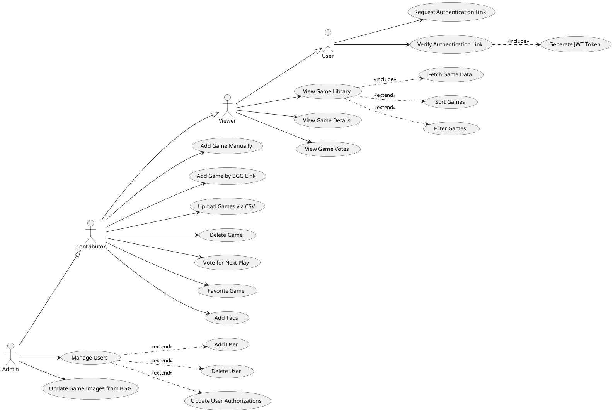
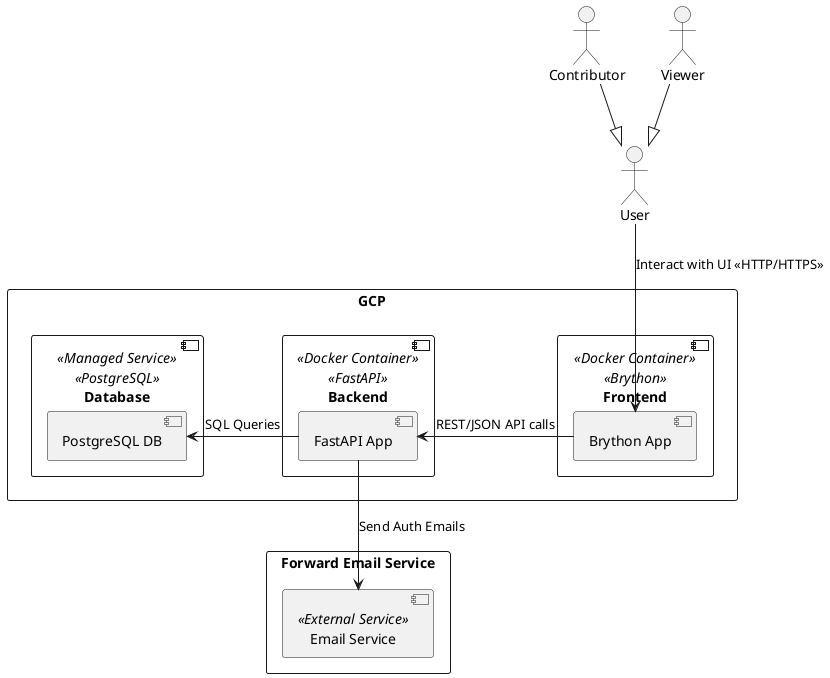
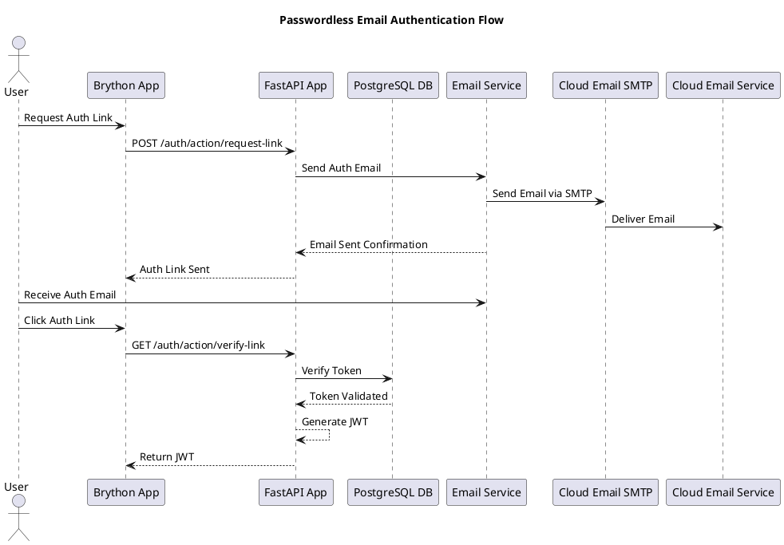
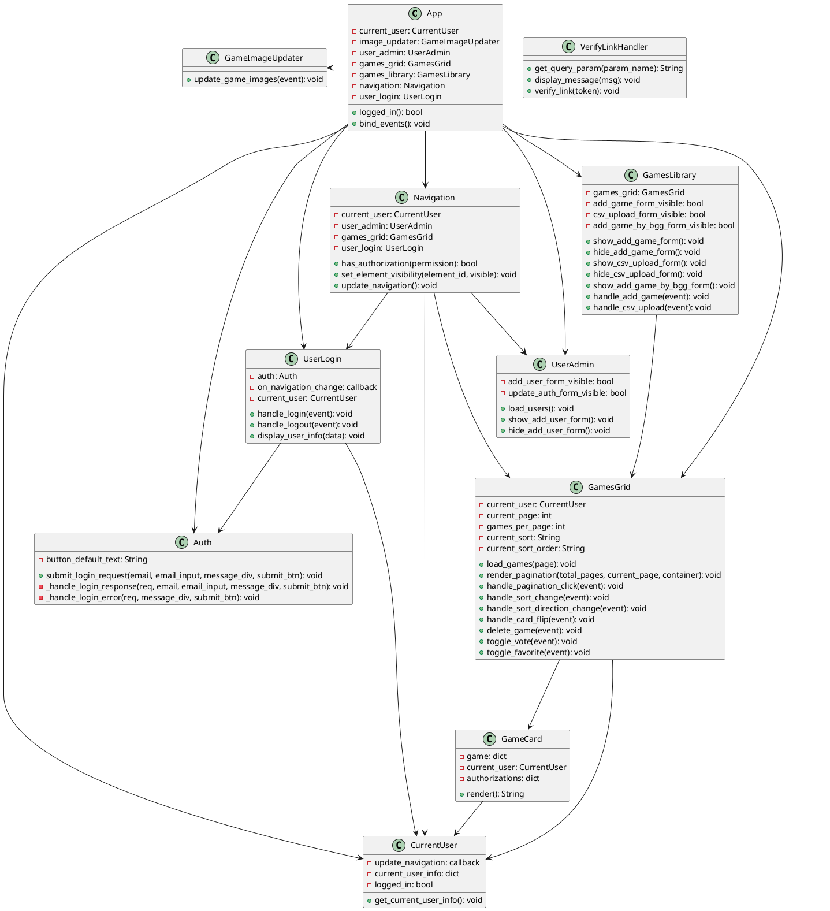
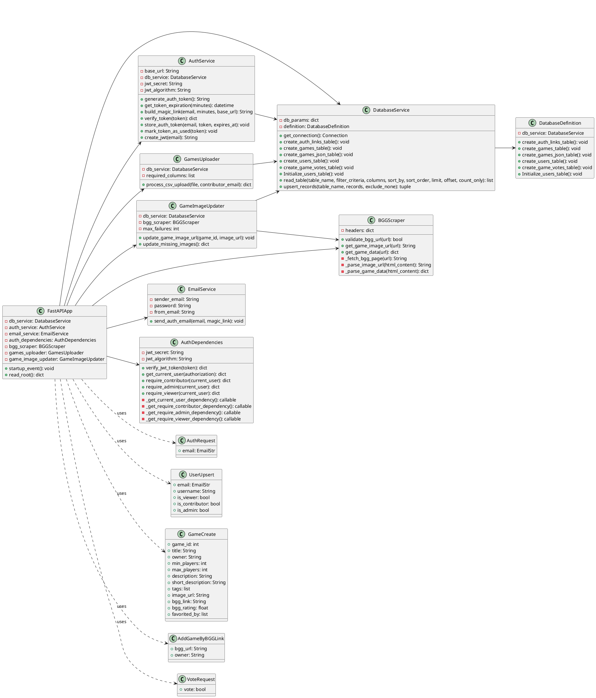

# Game Group Site


## Requirements
- Authentication is done via a passwordless email auth system 
    - User requests authentication link by entering their email
    - System verifies email is in user database table
    - Generates one-time link (magic link)
    - Email is sent to user with link
    - User clicks link which verifies them
    - A JWT token is generated with their user ID and access level (viewer or contributor or admin, etc.)
- Authorization
    - Access is granted by verifying the JWT and the access levels contained therein
    - Three authorization levels: Viewer, Contributor, Admin (with inheritance)

## Use Cases

### Viewer Use Cases
- **View Game Library**
    - Games are displayed in a card grid layout with pagination (20 games per page)
    - Each game card shows title, owner, player count, BGG rating, image, and vote count
    - Cards flip to show additional details on click
    - Sortable by title, owner, player count, or BGG rating (ascending/descending)
    - Navigation controls for pagination
- **View Game Details**
    - Full game information including description, tags, and BGG link
    - View which users have voted for the game
    - View which users have favorited the game
- **View Current User Info**
    - Display email, username, and authorization levels

### Contributor Use Cases (includes all Viewer capabilities)
- **Add Game Manually**
    - Form with fields:
        - Game title (required)
        - Game owner/username (required)
        - Minimum players (required)
        - Maximum players (required)
        - BoardGameGeek link (optional)
        - BoardGameGeek rating (optional)
- **Add Game by BGG Link**
    - Provide BGG URL and owner
    - System scrapes game data from BoardGameGeek
    - Auto-populates title, description, image, player count, and rating
- **Upload Games via CSV**
    - Bulk import games from CSV file
    - Required columns: title, owner, min_players, max_players
    - Optional columns: bgg_link, bgg_rating, description, tags, image_url
- **Delete Game**
    - Remove games from the library
- **Vote for Next Play**
    - Toggle vote on games to indicate interest in playing
    - Votes are tracked per user and displayed on game cards
- **Favorite Game**
    - Mark games as favorites
    - Favorites are tracked per user

### Admin Use Cases (includes all Contributor capabilities)
- **Manage Users**
    - View all users in the system
    - Add new users with email and username
    - Set user authorization levels (Viewer, Contributor, Admin)
    - Update user authorizations
    - Delete users from the system
- **Update Game Images**
    - Batch update missing game images by scraping BoardGameGeek
    - Processes games with BGG links but missing images


```plantuml
@startuml
left to right direction

' Actors with inheritance
actor User
actor Viewer
actor Contributor
actor Admin

Viewer --|> User
Contributor --|> Viewer
Admin --|> Contributor

' Authentication Use Cases (all users)
User --> (Request Authentication Link)
User --> (Verify Authentication Link)
(Verify Authentication Link) ..> (Generate JWT Token) : <<include>>

' Game Library Viewing (Viewer+)
Viewer --> (View Game Library)
(View Game Library) ..> (Fetch Game Data) : <<include>>
(View Game Library) ..> (Sort Games) : <<extend>>
(View Game Library) ..> (Filter Games) : <<extend>>
Viewer --> (View Game Details)
Viewer --> (View Game Votes)

' Game Management (Contributor+)
Contributor --> (Add Game Manually)
Contributor --> (Add Game by BGG Link)
Contributor --> (Upload Games via CSV)
Contributor --> (Delete Game)
Contributor --> (Vote for Next Play)
Contributor --> (Favorite Game)

' Admin Functions (Admin only)
Admin --> (Manage Users)
(Manage Users) ..> (Add User) : <<extend>>
(Manage Users) ..> (Delete User) : <<extend>>
(Manage Users) ..> (Update User Authorizations) : <<extend>>
Admin --> (Update Game Images from BGG)

' Tag Management (planned)
' note right of (View Tags)
'   Planned features
'   not yet implemented
' end note
' Viewer --> (View Tags)
Contributor --> (Add Tags)

@enduml
```


## Architecture


```plantuml
@startuml
actor User
actor Contributor
actor Viewer
'viewer and contributor are both users subtypes of user
Viewer --|> User
Contributor --|> User

rectangle "GCP" {
    component "Frontend" <<Docker Container>> <<Brython>> {
        component "Brython App"
    }
    component "Backend" <<Docker Container>> <<FastAPI>> {
        component "FastAPI App"
    }
    component "Database" <<Managed Service>> <<PostgreSQL>> {
        component "PostgreSQL DB"
    }
}
rectangle "Forward Email Service" {
    component "Email Service" <<External Service>> {
    }
}
"FastAPI App" -d-> "Email Service" : Send Auth Emails
"Brython App" -r-> "FastAPI App" : REST/JSON API calls
"FastAPI App" -r-> "PostgreSQL DB" : SQL Queries

User --> "Brython App" : Interact with UI <<HTTP/HTTPS>>
@enduml
```
### FastAPI Routes

#### Authentication
- `POST /auth/action/request-link` - Request a one-time authentication link via email (only sends if email exists in user table)
- `GET /auth/action/verify-link` - Verify the one-time authentication link and return JWT token
- `GET /auth/me` - Get current authenticated user information including authorizations

#### Games
- `GET /game` - Retrieve the list of games with pagination and optional sorting (viewer access required)
- `POST /game` - Add a new game to the library (contributor access required)
- `POST /game/upload-csv` - Upload CSV file to bulk import games (contributor access required)

#### Tags
- `GET /tag` - Retrieve the list of predefined tags (TODO: not yet implemented)
- `POST /tag` - Add a new tag to the predefined list (contributor access required, TODO: not yet implemented)

#### Admin
- `POST /admin/action/update-game-images` - Update missing game image URLs from BoardGameGeek (admin access required)
- `GET /admin/user` - Get all users in the system (admin access required)

#### Other
- `GET /` - Root endpoint, returns Hello World

<hr>


```plantuml
@startuml
title Passwordless Email Authentication Flow
actor User
participant "Brython App" as Brython
participant "FastAPI App" as FastAPI
participant "PostgreSQL DB" as DB
participant "Email Service" as EmailService
participant "Cloud Email SMTP" as CloudEmailSMTP
participant "Cloud Email Service" as CloudEmailService
User -> Brython : Request Auth Link
Brython -> FastAPI : POST /auth/action/request-link
FastAPI -> EmailService : Send Auth Email
EmailService -> CloudEmailSMTP : Send Email via SMTP
CloudEmailSMTP -> CloudEmailService : Deliver Email
EmailService --> FastAPI : Email Sent Confirmation
FastAPI --> Brython : Auth Link Sent
User -> EmailService : Receive Auth Email
User -> Brython : Click Auth Link
Brython -> FastAPI : GET /auth/action/verify-link
FastAPI -> DB : Verify Token
DB --> FastAPI : Token Validated
FastAPI --> FastAPI : Generate JWT
FastAPI --> Brython : Return JWT
@enduml
```
### Tech Requirements
- Stack
    - Frontend
        - Brython
        - ONLY uses REST/JSON API of the backend (no form posts)
    - Buisness Logic 
        - FastAPI 
    - Database
        - PostgreSQL
- Hosting
    - Google Cloud Platform (GCP) using Cloud Run for container hosting
    - Managed PostgreSQL instance on GCP
- Email Service
    - Use a third-party email service (Forward Email)
    - FastAPI backend will interact with the email service via SMTP to send authentication emails
- Containerization
    - Use Docker to containerize both the frontend Brython app and the backend FastAPI app
- Security
    - Use HTTPS for all communications between the user and the frontend, and between the frontend and backend


### Code organization
```
backend/
├── main.py                        # Main FastAPI app
├── db_utils.py                    # Database utilities (shared)
├── db_definition.py               # Database schema (shared)
├── auth_dependencies.py           # Auth dependencies (shared)
├── routers/
│   ├── admin/
│   │   ├── __init__.py
│   │   ├── router.py              # Admin routes
│   │   ├── models.py              # Admin models
│   │   └── game_image_updater.py  # Admin utility
│   ├── auth/
│   │   ├── __init__.py
│   │   ├── router.py              # Auth routes
│   │   ├── models.py              # Auth models
│   │   ├── auth_utils.py          # Auth utilities
│   │   └── email_utils.py         # Email utilities
│   ├── game/
│   │   ├── __init__.py
│   │   ├── router.py              # Game routes
│   │   ├── models.py              # Game models
│   │   ├── helpers.py             # Game helper functions
│   │   ├── bgg_scraper.py         # BGG scraper
│   │   ├── csv_utils.py           # CSV utilities
│   │   └── vote_service.py        # Vote service
│   └── tag/
│       ├── __init__.py
│       └── router.py              # Tag routes
```


### Class Diagram - Frontend


```plantuml
@startuml
class App {
    - current_user: CurrentUser
    - image_updater: GameImageUpdater
    - user_admin: UserAdmin
    - games_grid: GamesGrid
    - games_library: GamesLibrary
    - navigation: Navigation
    - user_login: UserLogin
    + logged_in(): bool
    + bind_events(): void
}

class Auth {
    - button_default_text: String
    + submit_login_request(email, email_input, message_div, submit_btn): void
    - _handle_login_response(req, email, email_input, message_div, submit_btn): void
    - _handle_login_error(req, message_div, submit_btn): void
}

class CurrentUser {
    - update_navigation: callback
    - current_user_info: dict
    - logged_in: bool
    + get_current_user_info(): void
}

class UserLogin {
    - auth: Auth
    - on_navigation_change: callback
    - current_user: CurrentUser
    + handle_login(event): void
    + handle_logout(event): void
    + display_user_info(data): void
}

class Navigation {
    - current_user: CurrentUser
    - user_admin: UserAdmin
    - games_grid: GamesGrid
    - user_login: UserLogin
    + has_authorization(permission): bool
    + set_element_visibility(element_id, visible): void
    + update_navigation(): void
}

class GamesLibrary {
    - games_grid: GamesGrid
    - add_game_form_visible: bool
    - csv_upload_form_visible: bool
    - add_game_by_bgg_form_visible: bool
    + show_add_game_form(): void
    + hide_add_game_form(): void
    + show_csv_upload_form(): void
    + hide_csv_upload_form(): void
    + show_add_game_by_bgg_form(): void
    + handle_add_game(event): void
    + handle_csv_upload(event): void
}

class GamesGrid {
    - current_user: CurrentUser
    - current_page: int
    - games_per_page: int
    - current_sort: String
    - current_sort_order: String
    + load_games(page): void
    + render_pagination(total_pages, current_page, container): void
    + handle_pagination_click(event): void
    + handle_sort_change(event): void
    + handle_sort_direction_change(event): void
    + handle_card_flip(event): void
    + delete_game(event): void
    + toggle_vote(event): void
    + toggle_favorite(event): void
}

class GameCard {
    - game: dict
    - current_user: CurrentUser
    - authorizations: dict
    + render(): String
}

class UserAdmin {
    - add_user_form_visible: bool
    - update_auth_form_visible: bool
    + load_users(): void
    + show_add_user_form(): void
    + hide_add_user_form(): void
}

class GameImageUpdater {
    + update_game_images(event): void
}

class VerifyLinkHandler {
    + get_query_param(param_name): String
    + display_message(msg): void
    + verify_link(token): void
}

App --> CurrentUser
App ----> Auth
App -> UserLogin
App --> Navigation
App -> GamesLibrary
App ----> GamesGrid
App -> UserAdmin
App -l--> GameImageUpdater
UserLogin --> Auth
UserLogin --> CurrentUser
Navigation --> CurrentUser
Navigation --> UserLogin
Navigation --> UserAdmin
Navigation --> GamesGrid
GamesLibrary ---> GamesGrid
GamesGrid --> CurrentUser
GamesGrid ---> GameCard
GameCard --> CurrentUser
@enduml
```

### Class Diagram - Backend


```plantuml
@startuml
left to right direction
class FastAPIApp {
    - db_service: DatabaseService
    - auth_service: AuthService
    - email_service: EmailService
    - auth_dependencies: AuthDependencies
    - bgg_scraper: BGGScraper
    - games_uploader: GamesUploader
    - game_image_updater: GameImageUpdater
    + startup_event(): void
    + read_root(): dict
}

class DatabaseService {
    - db_params: dict
    - definition: DatabaseDefinition
    + get_connection(): Connection
    + create_auth_links_table(): void
    + create_games_table(): void
    + create_games_json_table(): void
    + create_users_table(): void
    + create_game_votes_table(): void
    + Initialize_users_table(): void
    + read_table(table_name, filter_criteria, columns, sort_by, sort_order, limit, offset, count_only): list
    + upsert_records(table_name, records, exclude_none): tuple
}

class DatabaseDefinition {
    - db_service: DatabaseService
    + create_auth_links_table(): void
    + create_games_table(): void
    + create_games_json_table(): void
    + create_users_table(): void
    + create_game_votes_table(): void
    + Initialize_users_table(): void
}

class AuthService {
    - base_url: String
    - db_service: DatabaseService
    - jwt_secret: String
    - jwt_algorithm: String
    + generate_auth_token(): String
    + get_token_expiration(minutes): datetime
    + build_magic_link(email, minutes, base_url): String
    + verify_token(token): dict
    + store_auth_token(email, token, expires_at): void
    + mark_token_as_used(token): void
    + create_jwt(email): String
}

class EmailService {
    - sender_email: String
    - password: String
    - from_email: String
    + send_auth_email(email, magic_link): void
}

class AuthDependencies {
    - jwt_secret: String
    - jwt_algorithm: String
    + verify_jwt_token(token): dict
    + get_current_user(authorization): dict
    + require_contributor(current_user): dict
    + require_admin(current_user): dict
    + require_viewer(current_user): dict
    - _get_current_user_dependency(): callable
    - _get_require_contributor_dependency(): callable
    - _get_require_admin_dependency(): callable
    - _get_require_viewer_dependency(): callable
}

class BGGScraper {
    - headers: dict
    + validate_bgg_url(url): bool
    + get_game_image_url(url): String
    + get_game_data(url): dict
    - _fetch_bgg_page(url): String
    - _parse_image_url(html_content): String
    - _parse_game_data(html_content): dict
}

class GamesUploader {
    - db_service: DatabaseService
    - required_columns: list
    + process_csv_upload(file, contributor_email): dict
}

class GameImageUpdater {
    - db_service: DatabaseService
    - bgg_scraper: BGGScraper
    - max_failures: int
    + update_game_image_url(game_id, image_url): void
    + update_missing_images(): dict
}

/' Pydantic Models '/
class AuthRequest {
    + email: EmailStr
}

class UserUpsert {
    + email: EmailStr
    + username: String
    + is_viewer: bool
    + is_contributor: bool
    + is_admin: bool
}

class GameCreate {
    + game_id: int
    + title: String
    + owner: String
    + min_players: int
    + max_players: int
    + description: String
    + short_description: String
    + tags: list
    + image_url: String
    + bgg_link: String
    + bgg_rating: float
    + favorited_by: list
}

class AddGameByBGGLink {
    + bgg_url: String
    + owner: String
}

class VoteRequest {
    + vote: bool
}

/' Relationships '/
FastAPIApp --> DatabaseService
FastAPIApp --> AuthService
FastAPIApp --> EmailService
FastAPIApp --> AuthDependencies
FastAPIApp --> BGGScraper
FastAPIApp --> GamesUploader
FastAPIApp --> GameImageUpdater
DatabaseService --> DatabaseDefinition
AuthService --> DatabaseService
GamesUploader --> DatabaseService
GameImageUpdater --> DatabaseService
GameImageUpdater --> BGGScraper
FastAPIApp ..> AuthRequest : uses
FastAPIApp ..> UserUpsert : uses
FastAPIApp ..> GameCreate : uses
FastAPIApp ..> AddGameByBGGLink : uses
FastAPIApp ..> VoteRequest : uses
@enduml
```

### TODOs
- [ ] TODO: Fix the whole db_util class to be flexible instead of one-off per query and table
- [ ] TODO: Add an automatic population by providing BGG link and scraping BGG for the info
- [ ] TODO: Add a Play Log section recording when users play games and with whom, etc.
- [ ] TODO: Add a Next Play section showing which games people want to play next and allowing people to vote on which games they want to play next
- [ ] TODO: Add router and tags to categorize the API endpoints better and make them more maintainable
- [ ] TODO: Make filter_criteria safer by accepting a list of tuples of (column, operator, value) and building the WHERE clause using that information and escaping text values by encoding them as base64 and decoding them in the backend before using them in the query. This would prevent SQL injection while still allowing for flexible filtering.
- [ ] TODO: Harden read_table() against SQL injection by validating table_name and filter_criteria inputs
- [ ] TODO: Implement the tag retrieval endpoint (`GET /tag`) to allow users to fetch the list of predefined tags
- [ ] TODO: Implement the tag addition endpoint (`POST /tag`) with proper authorization checks for contributors
- [ ] TODO: Update the admin user retrieval in the backend to allow filtering by email or other parameters for frontend admin panel management
- [ ] TODO: Make the forwarded port/host detection in the backend configurable from application config instead of using hardcoded conditional logic
- [ ] TODO: Make the frontend nginx configuration ports (8082 and 8443) configurable via environment variables for flexible deployment
- [ ] TODO: Make the frontend nginx server_name configurable via environment variables for flexible domain configuration
- [ ] TODO: Rework the Authorizations in the JWT to use an Authorization object that is a list of the authorization levels of the user

